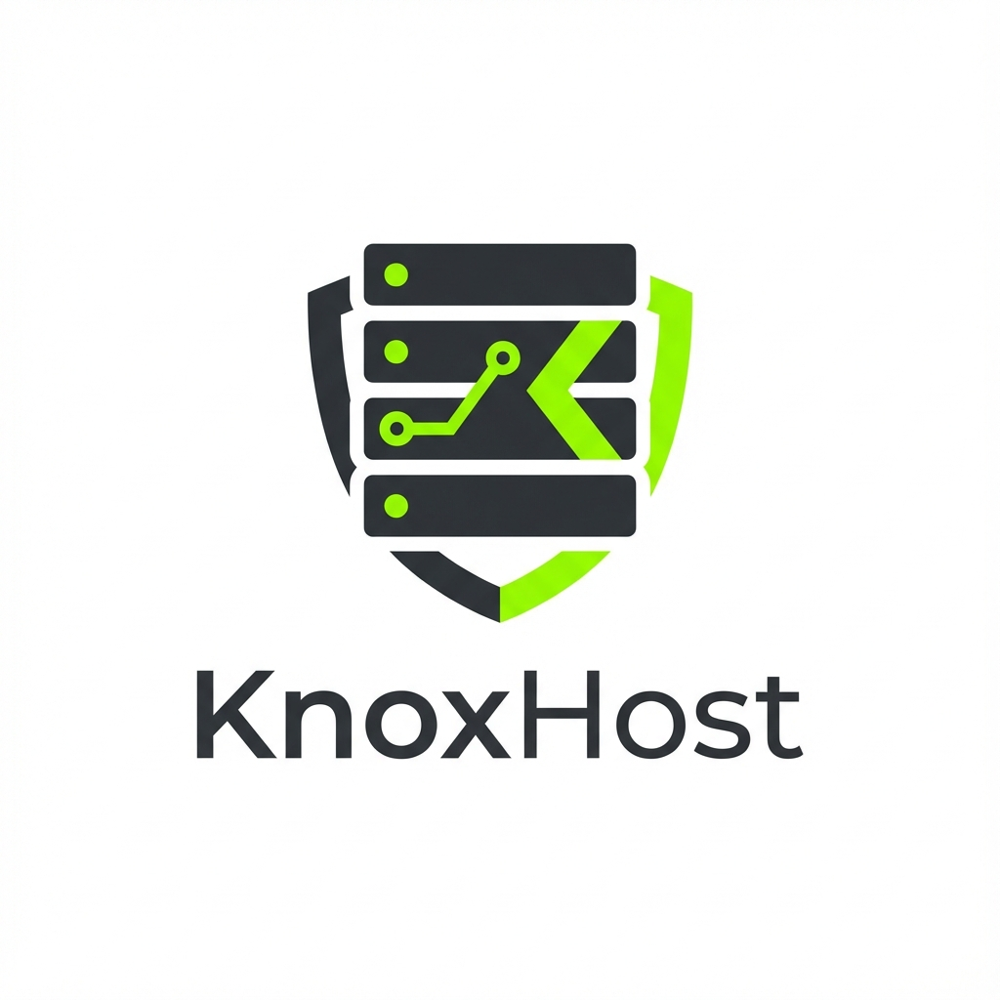

# KnoxHost



[](https://discord.gg/Qzamd6dQzK)

**KnoxHost** is a modern, server management tool for *Project Zomboid*. Built with Electron and React, it provides a streamlined interface for deploying, configuring, and managing your dedicated servers.


## Why KnoxHost?

I  built KnoxHost to solve a specific issue I faced while trying to host a server for my friends: being stuck at initializing for years...

When hosting via standard methods, SteamCMD forces a full redownload and verification of all workshop mods every time the server starts. For heavily modded servers, this causes the process to get stuck on "Initializing" for ages.

**KnoxHost bypasses this bottleneck.** It lets you host a server with a press of a button while also skipping this mod reinstall problem that is in the base server.


## Features

-   **🚀 One-Click Deployment**: Install and update the dedicated server via SteamCMD automatically.
-   **⚙️ Advanced Configuration**: Visual editor for Sandbox settings, Spawn Regions, and Zombie Lore.
-   **📦 Mod Manager**: Browse, search, and install Steam Workshop mods directly from the app.
-   **🛡️ Whitelist Management**: Manage user access with an integrated SQLite-backed whitelist interface.
-   **🔄 Automated Tasks**: Schedule automatic backups and server restarts.
-   **🖥️ RCON Console**: Send commands directly to your server instance.
-   **🎨 Modern UI**: Tactical, dark-mode interface with interactive backgrounds and smooth animations.


-   **Electron Main**: Handles system operations, file I/O, and SteamCMD execution.
-   **React Renderer**: Provides the responsive user interface.
-   **IPC Bridge**: Secure communication layer between frontend and backend.
-   **SQLite**: Local database for managing server whitelists.

## Installation

1.  Go to the **Releases** page.
2.  Download the latest `setup exe file`.
3.  Run the installer.

## Getting Started

### Prerequisites

-   Windows 10/11
-   Node.js (v16+)
-   Steam Account, no login in KnoxHost required (for Workshop content and SteamCMD)

### Developer Setup

1.  Clone the repository:
    ```bash
    git clone https://github.com/yourusername/KnoxHost.git
    ```
2.  Install dependencies:
    ```bash
    npm install
    ```
3.  Start the development server:
    ```bash
    npm run dev
    ```

## Building for Production

To create a standalone executable:

```bash
npm run build
```

## Building the Application

To build the Windows executable:

```bash
npm run build:win
```

The output executable will be located in the `dist-electron` directory.

## License

MIT License - see [LICENSE](LICENSE) for details.
